# PokeAPI App
___
## Índice
- [Introducción](#introducción)
  - [Postman](#postman) 
- [Manual técnico para desarrolladores](#manual-técnico-para-desarrolladores)
  - [Requisitos previos](#requisitos-previos) 
  - [Estructura](#estructura) 
  - [Metodología](#metodología) 
  - [Configuración de Maven](#configuración-de-maven) 
  - [Configuración de JavaFx](#configuración-de-javafx)
  - [Ejecución del proyecto](#ejecución-del-proyecto)
  - [Manejo de la caché y último estado](#manejo-de-la-caché-y-último-estado)
  - [Manejo de errores](#manejo-de-errores)
  - [Exportación de datos](#exportación-de-datos)
- [Manual de usuario](#manual-de-usuario)
  - [Búsquedas sencillas](#búsquedas-sencillas)
  - [Consultar la información del Pokémon](#consultar-la-información-del-pokémon)
  - [Otras opciones (limpiar datos y borrar caché)](#otras-opciones-limpiar-datos-y-borrar-caché)
  - [Registro](#registro)
  - [Exportaciones](#exportaciones)
  - [Guardado del último estado](#guardado-del-último-estado)
- [Reparto de tareas](#reparto-de-tareas)
- [Extras](#extras)
- [Mejoras](#mejoras)
- [Conclusiones](#conclusiones)
- [Autores](#autores)

## Introducción
[Volver al índice](#índice)

Esta es una aplicación que permite realizar peticiones a la [API de Pokémon](https://pokeapi.co/) [(repositorio de GitHub)](https://github.com/PokeAPI/pokeapi). 

Tras una búsqueda por nombre, el programa mostrará los siguientes campos: número de identificación del pokémon, sprite (imagen) frontal por defecto, sus diferentes nombres en varios idiomas así como las áreas del juego en las que se encuentra el pokémon en estado salvaje.

También es posible registrarse, de modo que tras el registro (o inicio de sesión posterior) el programa permite recuperar la última búsqueda del usuario y también exportar a diferentes formatos la información recopilada.

___
### Postman
Se ha utilizado la aplicación [Postman](https://www.postman.com/) para testear diferentes peticiones a la [PokeAPI](https://pokeapi.co/). En concreto, se realizan 3 peticiones GET diferentes con las que componentos la información de nuestra aplicación.

A continuación se detalla cada petición con su respuesta adjuntando las capturas de Postman:

- #### *Pokémon*:
  La petición principal a partir de la que se guardan tanto el id como los nombres en diferentes idiomas es realizada a: https://pokeapi.co/api/v2/pokemon-species/{name} . Elegimos esta para este fin pues la respuesta  era considerablemente más corta que otras más completas.

  

- #### *Áreas*:
  La información relativa a las áreas es extraída de la dirección: https://pokeapi.co/api/v2/pokemon/{id}/encounters . Esta petición se lleva a cabo a través del id del pokémon.

  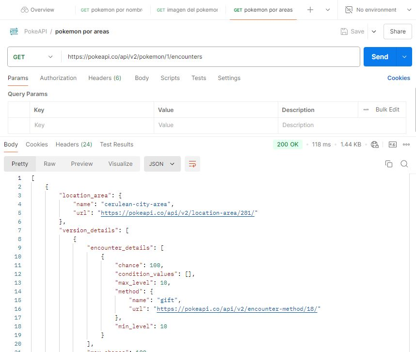
- #### *Imagen*
  Finalmente, la información sobre el sprite es obtenida a partir de la ruta: https://pokeapi.co/api/v2/pokemon/{name} . De nuevo aquí es necesario hacer una búsqueda por nombre, como en el primer caso.  Nos vamos a quedar exclusivamente con el sprite frontal por defecto, así nos aseguramos que todos los pokémon que existen tienen una referencia a su imagen. 
  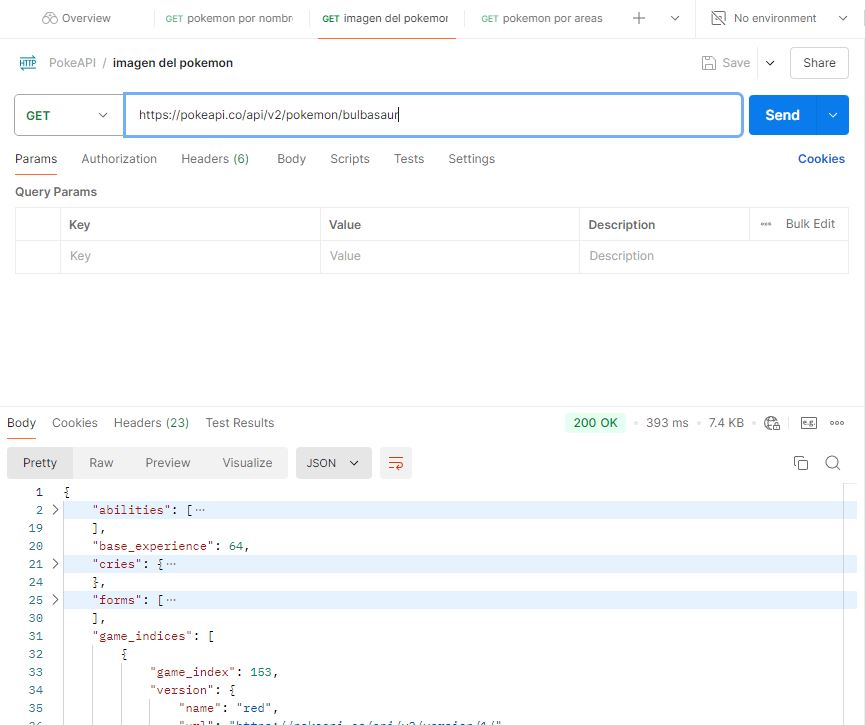


## Manual técnico para desarrolladores
[Volver al índice](#índice)

### Requisitos previos

- **Java SE 17 o superior**: El proyecto está desarrollado usando Java 17, por lo que necesitarás tener una versión igual o superior instalada. ([descargar](https://www.oracle.com/java/technologies/javase/jdk17-archive-downloads.html))
- **JavaFX 23.0.1**: El proyecto usa JavaFX para la interfaz gráfica, por lo que deberás incluir el SDK de JavaFX. ([descargar](https://gluonhq.com/products/javafx/))
- **Maven**: La gestión de dependencias se hace con Maven, por lo que deberás tener Maven instalado.([descargar](https://maven.apache.org/download.cgi))
- **IDE recomendado**: Se recomienda el uso de IntelliJ IDEA para un desarrollo más sencillo, pero se puede usar cualquier otro IDE compatible con Java. ([descargar](https://www.jetbrains.com/idea/download/?section=windows))


### Estructura
El proyecto está planteado siguiendo el patrón [Modelo-Vista-Controlador.](https://es.wikipedia.org/wiki/Modelo%E2%80%93vista%E2%80%93controlador)

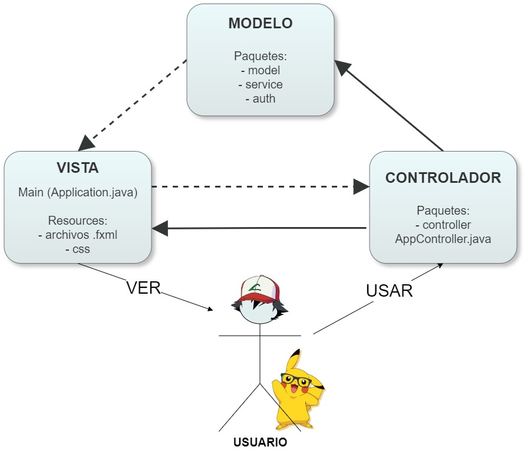

#### Modelo
___
El modelo contiene los datos del programa y define cómo estos deben ser manipulados, es decir, contiene la lógica que se necesita para gestionar el estado y las reglas del negocio.
Interactúa respondiendo a las solicitudes del controlador para acceder o actualizar los datos.  Notifica indirectamente a la vista cuando los datos han cambiado para que se actualice la presentación.

En nuestra aplicación cuenta con los siguientes paquetes:

- **<u>edu.badpals.pokeapi.model</u>**: Contiene las clases de modelos de datos como `PokemonData`, `Area`, `PokemonImage`(entre otras). Se utilizan estas clases para realizar el mapeado a los .json de respuesta de la API.


- **<u>edu.badpals.pokeapi.service</u>**: Gestiona las operaciones como peticiones API `APIPetitions`, manejo de caché `CacheManager`, exportación de datos `DocumentExporter` y guardado del último estado `StateManager`.


- **<u>edu.badpals.pokeapi.auth</u>**: la clase `LogInManager` se encarga tanto de verificar la autencidad de un usuario (comprobando sus credenciales en un fichero .properties) como de registrar nuevos usuarios. Las credenciales de los usuarios se guardan cifradas en el archivo. 


- **<u>/cache</u>**: en el directorio caché se guardan las respuestas a las peticiones que se han realizado a la API en sesiones previas, que son cargadas en el programa antes de hacer nuevas consultas, para mejorar el rendimiento. Los datos están almacenados en formato .json y las imágenes en .png .


- **<u>.appData</u>**: en este directorio se almacena en formato .bin la última búsqueda que realiza un usuario tras hacer logIn y salir de la aplicación. Cuando el usuario regresa puede restablecer esa búsqueda.

#### Controlador
___
El controlador recibe las entradas del usuario desde la vista y las traduce en acciones que el modelo debe ejecutar. Se encarga de interpretar las acciones del usuario, manejar los eventos, y de actualizar tanto el modelo como la vista.

- **<u>edu.badpals.pokeapi.controller</u>**: Coordina la interacción entre los diferentes componentes, y controla la lógica de la aplicación. Se gestiona todo desde la clase `AppController`.

#### Vista
___
Se encarga de la visualización de los datos del modelo de manera que el usuario los entienda. No contiene lógica de negocio, solo muestra lo que el modelo le proporciona.. La vista recibe entradas del usuario (clics, teclas, etc.) y las envía al controlador.

- `edu.badpals.pokeapi.Application.java`: Contiene la clase principal del programa, relacionada con la generación de la interfaz gráfica de usuario (con JavaFX). En ella se crean las escenas cuando se ejecuta el programa.


- **<u>resources</u>**: en el directorio resources se almacenan los recursos necesarios para construir la interfaz de usuario, desde los archivos .fxml en los que se diseñan las vistas, hasta la hoja de estilos css e imágenes. 

### Metodología
**Uso de Git**

Este proyecto sigue una metodología de desarrollo incremental basado en ramas, lo que facilita la gestión de versiones y la colaboración entre desarrolladores. Las ramas principales del proyecto son `main` y `develop`, mientras que el desarrollo se llevó a cabo en paralelo en las ramas `controller`, `service` y `model`.

El flujo de trabajo del desarrollo es el siguiente:

1. **Añadir Nuevas Funcionalidades**: Cuando se desea implementar una nueva funcionalidad, se trabaja en la rama propia al paquete que pertenece. Cada desarrollador trabaja en una única rama, permitiendo que el trabajo avance de manera independiente.

2. **Testeo**: Una vez que se ha completado la funcionalidad, se realizan pruebas para asegurar que todo funciona correctamente y cumple con los requisitos establecidos.

3. **Merge a Develop**: Después de las pruebas exitosas, se realiza un "merge" de la rama de funcionalidad a `develop`. Este paso es crucial para comprobar la integración de la nueva funcionalidad con el resto del código del proyecto.

4. **Merge a Main**: Finalmente, cuando la versión en `develop` ha sido probada y se confirma que es estable, se realiza un "merge" a la rama `main`. Esto marca el lanzamiento de una nueva versión del proyecto.

Este enfoque permite una colaboración fluida entre los dos desarrolladores, asegurando que el código sea de alta calidad y esté bien integrado antes de ser lanzado.

### Configuración de Maven

El archivo `pom.xml` incluye las siguientes dependencias importantes:

```xml
<dependencies>
    <!-- Dependencias para JavaFX -->
    <dependency>
      <groupId>org.openjfx</groupId>
      <artifactId>javafx-fxml</artifactId>
      <version>17.0.6</version>
    </dependency>

    <!-- Dependencias para JSON (Jackson) -->
    <dependency>
        <groupId>com.fasterxml.jackson.core</groupId>
        <artifactId>jackson-databind</artifactId>
        <version>2.18.0-rc1</version>
    </dependency>

  <!-- También se incluyen las siguientes dependencias para realizar testing, 
  pero no se han añadido test durante el desarrollo -->
  
    <dependency>
      <groupId>org.junit.jupiter</groupId>
      <artifactId>junit-jupiter-api</artifactId>
      <version>${junit.version}</version>
      <scope>test</scope>
    </dependency>
    <dependency>
      <groupId>org.junit.jupiter</groupId>
      <artifactId>junit-jupiter-engine</artifactId>
      <version>${junit.version}</version>
      <scope>test</scope>
    </dependency>
</dependencies>
```
### Configuración de JavaFX

Para ejecutar el proyecto con JavaFX, tras [descargar el SDK]((https://gluonhq.com/products/javafx/)) se necesitan añadir los siguientes módulos en la configuración de tu IDE:

```
--module-path="ruta\directorio\javaFx\lib" --add-modules="javafx.base,javafx.controls,javafx.fxml,javafx.graphics,javafx.swing,javafx.media"
```
Para ejecutar el programa directamente en el IDE, es necesario añadirlos en *File>Project Structure>Global Libraries>New Global Library>Java* y a continuación cargar los .jar del directorio lib donde se haya guardado javaFx. 

También es posible preparar la ejecución del .jar del programa desde la ventana de *Run /Debug Configurations* añadiendo en *VM options* las líneas del cuadro anterior.

### Ejecución del proyecto

#### Desde el IDE (IntelliJ IDEA):

1. Importar el proyecto como un proyecto Maven.
2. Asegurarse de que las dependencias estén instaladas en el `pom.xml`.
3. Configurar los módulos de JavaFX como se describió anteriormente.
4. Ejecutar la clase `Main` para iniciar la aplicación.

#### Desde la terminal:
Una vez que el JAR esté generado, se ejecuta el siguiente comando **desde el directorio donde se encuentre el .jar generado**:
``` bash
java --module-path="/ruta/al/javafx/lib" --add-modules="javafx.base,javafx.controls,javafx.fxml,javafx.graphics,javafx.swing,javafx.media" -jar nombre-del-archivo.jar
```

### Manejo de la caché y último estado

El proyecto almacena los datos de los Pokémon consultados y sus imágenes localmente en la carpeta de caché (`/cache`).

- Los datos JSON se guardan usando la clase `CacheManager`, que guarda las respuestas de la API localmente para evitar llamadas repetidas.
- Las imágenes de los Pokémon se descargan y guardan en formato `.png` en el mismo directorio.

Se puede limpiar la caché con el método `deleteCache()` de la clase `CacheManager`.

El último estado del usuario loggeado se almacena en formato `.bin` en el directorio oculto `.appData`. Cuando se inicia sesión se muestra este estado y se almacena cuando el usuario loggeado sale del programa. 

### Manejo de errores

En la aplicación, los errores se gestionan de dos maneras:
- Los errores que ocurren en las clases del **modelo** o de **service** (relacionadas con la lógica interna) se manejan de forma interna y se registran en un archivo de log. Así cuando se captura una excepción, se llama a una función de la clase ErrorLogger, que se encarga de escribir el mensaje en el fichero log.


- Por otro lado, los errores que se producen en la **interfaz de usuario** se presentan directamente en pantalla, para que el usuario pueda comprender qué ha fallado.

Para registrar los errores del modelo, existe una clase llamada `ErrorLogger`, ubicada en el paquete `service`. Esta clase es responsable de guardar los errores en un archivo llamado `error.log`, que se encuentra en la carpeta oculta `.appData`.


### Exportación de datos

El proyecto permite exportar la información de los Pokémon a diferentes formatos, como `.json`, `.xml`, `.txt`, y `.bin`.

- La exportación se maneja dentro de la clase `DocumentExporter`, y se puede seleccionar el formato que se prefiera tras hacer una consulta (aunque esto sólo se mostrará en la vista cuando el usuario se autentifique).

## Manual de usuario
[Volver al índice](#índice)

### Búsquedas sencillas

Al abrir la aplicación, el usuario verá una pantalla como la que se muestra a continuación

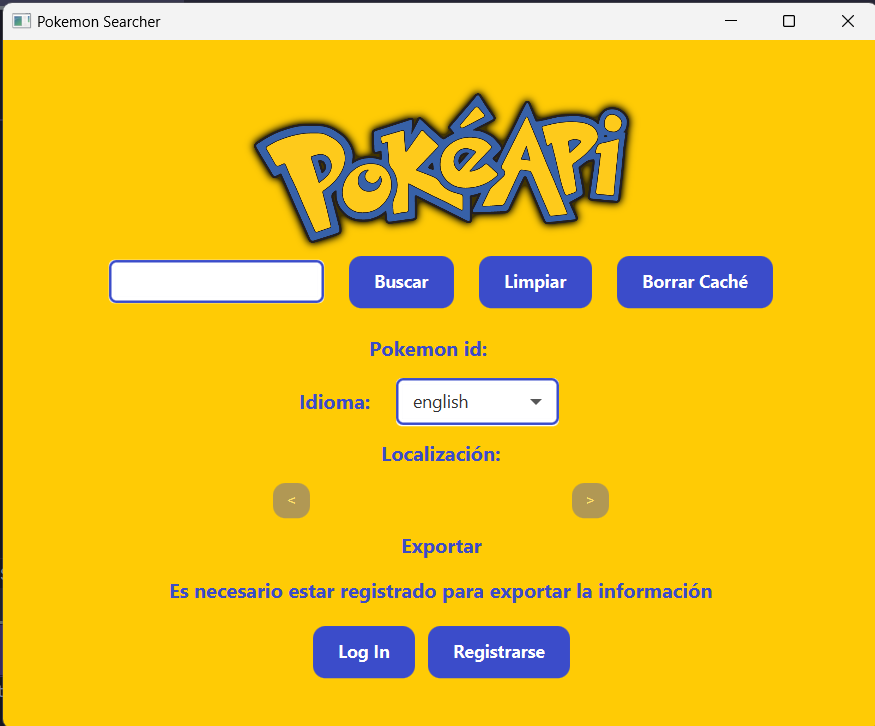

El usuario deberá escribir el nombre del pokemon cuya información quiera buscar en la caja de texto, y a continuación pulsar en el botón buscar.

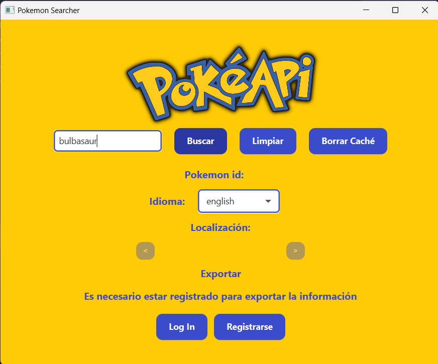


De forma automática se cargarán por pantalla la imagen, el nombre con la tipografía típica de los juegos de pokémon, su id, el nombre en inglés y un área dónde se puede encontrar en los juegos.


Nótese que la aplicación no distingue mayúsculas y minúsculas, por lo que el usuario no tendrá que tener cuidado en ese aspecto a la hora de teclear el nombre del pokémon, como se muestra en el siguiente ejemplo:

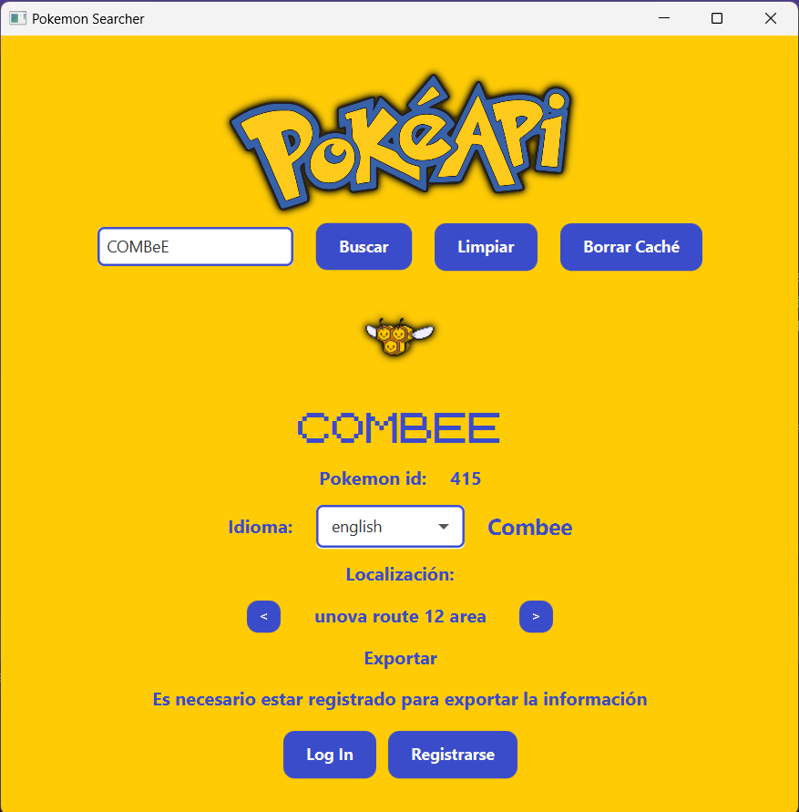

Por otro lado, si el usuario intenta buscar el nombre de un pokémon no existente, o lo teclea mal, se mostrará un mensaje de error al usuario, como se muestra en las capturas siguientes.

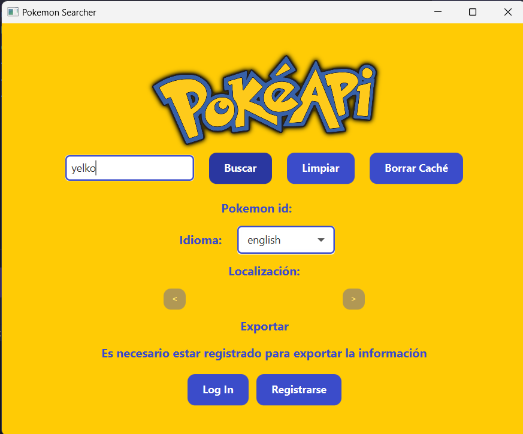

Este mensaje se mostrará también en el caso de que no haya conexión a internet y no se pueda acceder a la API.

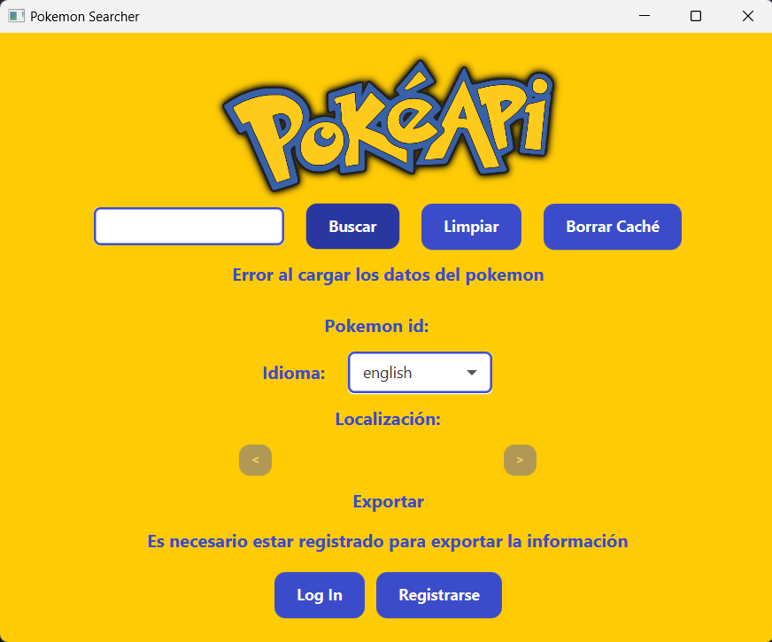

### Consultar la información del Pokémon

Aunque la mayoría de idiomas utilizzan los nombres en inglés para denominar a cada especie pokémon, algunos emplean otros diferentes. En concreto estos son el japonés, el coreano, el francés, el alemán y el chino. El usuario podrá escoger cualquiera de estos en la caja de selección y automáticamente verá el nombre del pokemon en dicho idioma.

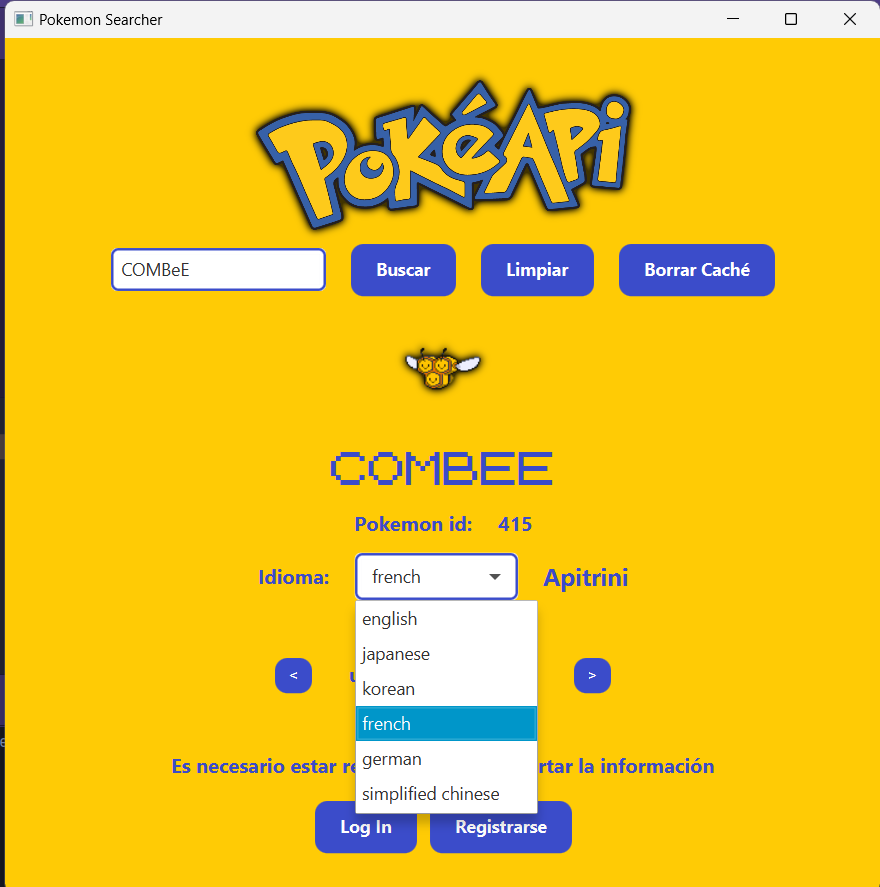

Además, la mayoría de los pokémon se encuentran en múltiples rutas, y podrá consultar todas ellas pulsando los botones con las flechas "&lt;" y "&gt;" para moverse a la ruta anterior y la siguiente respectivamente. Las rutas están configuradas de forma cíclica, de forma que al darle a siguiente en la última, volverá a mostrarse la primera.


Al buscar a algunos pokémon, los botones de siguiente ruta y de ruta anterior aparecen bloqueados. Esto significa que el pokémon que se ha buscado solo se puede encontrar en la ruta que se muestra.


Otros pokémon no se pueden encontrar en ninguna parte del mapa, pues presentan otros métodos de obtención (evolución, por ejemplo). En estos casos se mostrará el mensaje de que no se halla en estado salvaje y los botones de anterior y siguiente también aparecerán bloqueados.


### Otras opciones (limpiar datos y borrar caché)

Si se ha acabado de consultar la información de un pokémon, se puede limpiar todos los campos de búsqueda pulsando el botón limpiar.

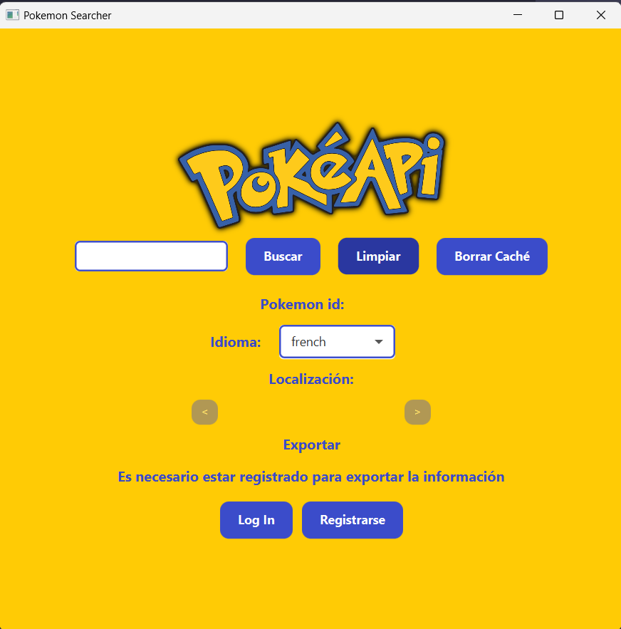

A medida que se realizan búsquedas, la aplicación guarda la información en caché (archivos almacenados en local), de forma que si se vuelve a buscar al mismo pokémon, la aplicación muestre los resultados más rápidamente. Además, de no haber internet, las búsquedas a pokémons ya buscados previamente se podrán realizar sin problemas.

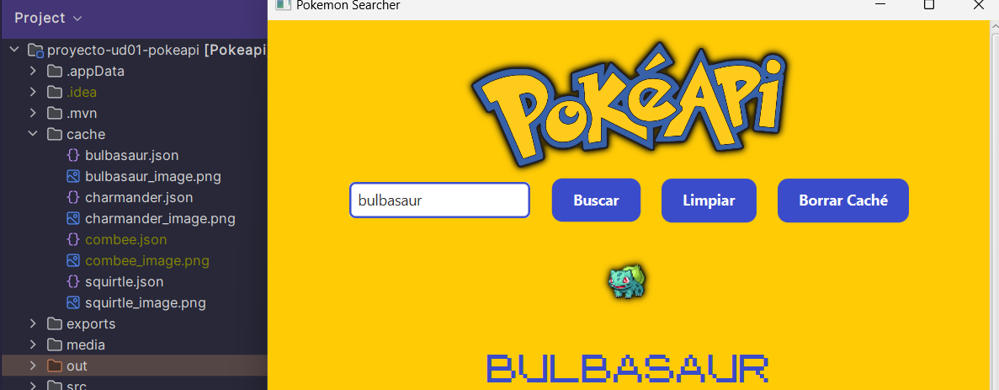

No obstante, si dichos archivos llegasen a ocupar demasiado espacio, la aplicación dispone de un botón de Borrar Caché, que elimina todos esos archivos.

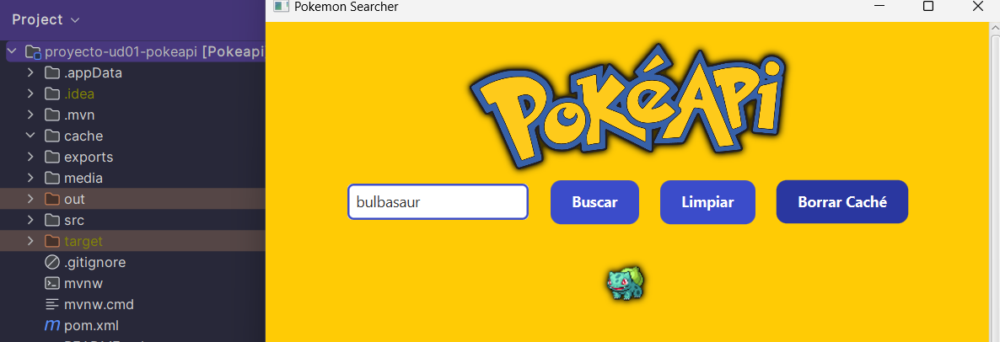

### Registro

El usuario probablemente ha observado también que en la parte inferior de la interfaz hay una sección de exportación, para lo cual es necesario haber iniciado sesión. La primera vez, el usuario deberá registrarse, pulsando el botón correspondiente, que se muestra resaltado en la imagen.


No podremos registrarnos con un nombre que ya haya sido registrado para otro usuario. 


Por ejemplo, al intentar registrarnos como david (ya existe un usuario con dicho nombre), nos mostrará un mensaje de que no nos hemos podido registrar.

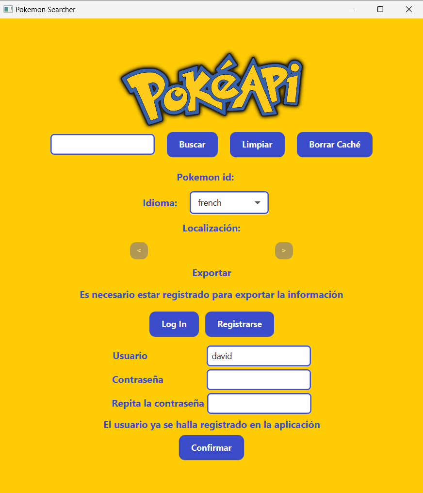

Además, por seguridad, se pide al usuario que introduzca la contraseña dos veces para evitar erratas.

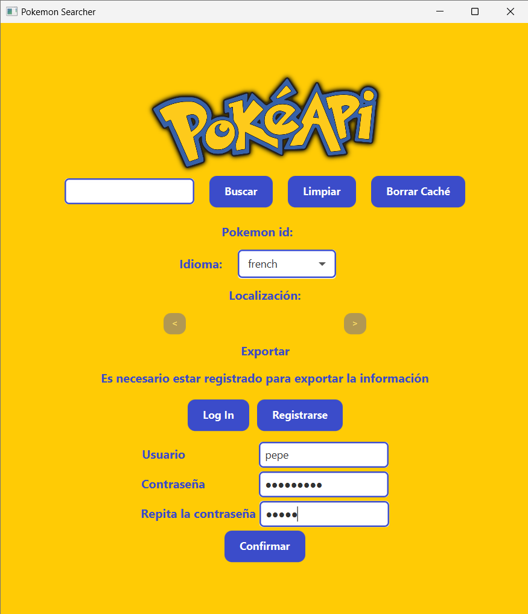

Del mismo modo que antes, si ambas contraseñas no coinciden, se mostrará un mensaje al usuario, dándole la oportunidad de que vuelva a intentarlo.


Al introducir credenciales válidas, se registrará al usuario, produciéndose el login de forma automática.

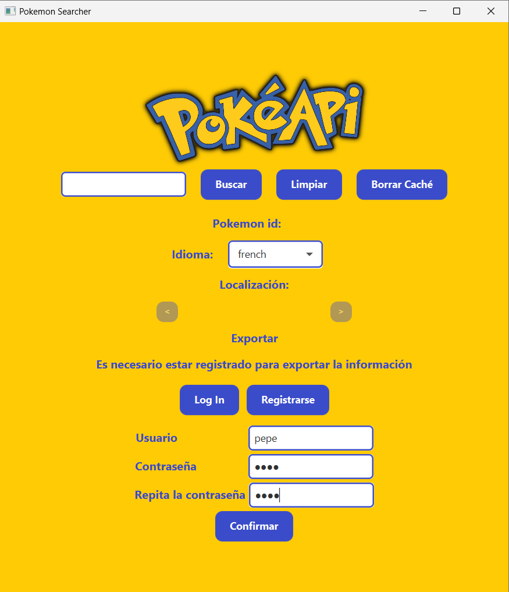

### Exportaciones

Tras el login, ya observamos el menú de exportación. Si no se ha buscado ningún pokémon, el botón de exportar aparece bloqueado, como se muestra en la imagen.


Pero tras cargar la información de cualquier pokémon, este aparecerá ya activado


Para realizar la exportación se deberá indicar la ruta dónde se querrá guardar la información, con el formato directorio/nombreArchivo (sin extensión), y además se escogerá en el selector el formato con el que queremos realizar la exportación.

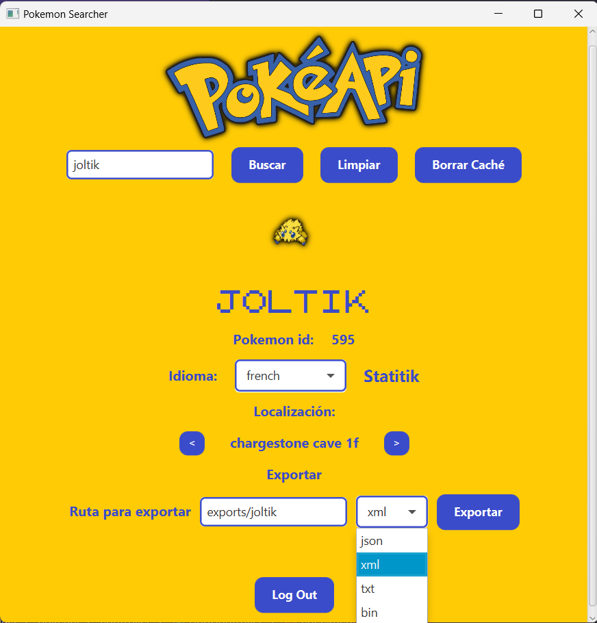

Tras clickar en el botón exportar nos informará de si la exportación ha sido correcta.

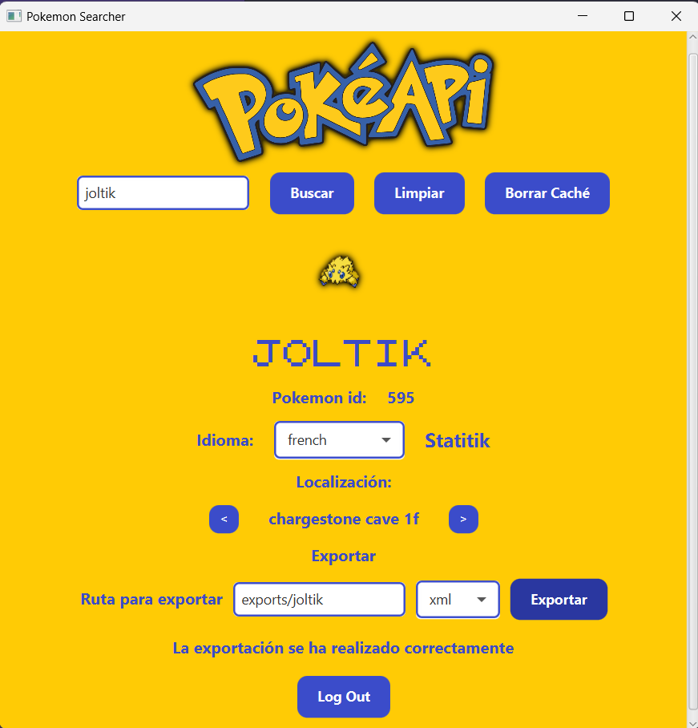

En caso afirmativo, veremos el archivo con el formato seleccionado en la ruta indicada.


En caso de introducir una ruta no existente, la exportación no se podrá llevar a cabo y se mostrará un mensaje al usuario.


### Guardado del último estado

En cualquier momento del uso de la aplicación se podrá pulsar el botón de logout para salir de la sesión.


Al pulsar el botón, nos desaparecerá el menú de exportar, y se limpiarán los datos del pokémon que se estaba consultando.


No obstante, el estado se guarda para cada usuario, y si volvemos a iniciar sesión,...


Vemos como se vuelve a cargar la información del último pokémon buscado por dicho usuario. Esta funcionalidad se mantiene si el usuario cierra la ventana de la aplicación y, tras volverla a arrancar, vuelve a iniciar sesión.


## Reparto de tareas
[Volver al índice](#índice)

A la hora de dividir el desarrollo de la aplicación entre los integrantes, en un principio repartimos los módulos, de forma que David Búa realizó las clases  para el futuro mapeo a los json que se reciben de la API, así como la interfraz gráfica y su controlador, mientras que Yelko Veiga desarrolló todas las funcionalidades recogidas en los módulos de service como login. De esta forma cada uno realizó commits correspondientes a estas partes. No obstante, durante todo el desarrollo ambos miembros estuvimos intercambiando ideas, proponiendo arreglos y mejoras a la otra parte, así como informándonos de las funcionalidades que era necesario implementar para que funcionasen otros módulos. Además, en determinadas ocasiones los miembros realizaron pequeños cambios en la parte del otro para mejorar la integración entre las partes. Por ejemplo, Yelko añadió una clase para poder guardar la URL de la imagen del pokemon, y David corrigió la forma en que se manejaban las excepciones en service para recogerlas con el AppController.

Finalmente, durante las últimas etapas del desarrollo, se realizaron correcciones mediante el uso de Pair Programming, por lo que hubo trabajo de ambos aunque el commit conste como realizado solo por uno, y la documentación de las clases y este mismo ReadMe se repartió entre ambos integrantes.


## Extras
[Volver al índice](#índice)

En la realización de este trabajo se incluyeron varios extras a mayores de los requisitos mínimos del proyecto. Los más destacables son los siquientes:

 - Guardado en caché de las búsquedas ya realizadas, para agilizar el acceso a la información ya consultada a la API, permitiendo también su consulta sin acceso a internet. Además, esto respeta las condiciones de uso establecidas por la API, como se puede consultar en [este enlace](https://pokeapi.co/docs/v2), en el apartado de Fair Use Policy.
 - Registros de usuario, mediante el guardado en un archivo de formato .properties de los valores de usuario y contraseña (esta última encriptada). Los usuarios logeados tendrán distintas funcionalidades que los que no inicien sesión.
 - Exportación de los datos obtenidos mediante las peticiones a la API (necesario iniciar sesión), en cuatro formatos (.txt, .bin, .json y .bin).
 - Guardado del último estado de sesión. En nuestro caso, en vez de preguntar si queremos recargar el último estado al arrancar la aplicación, por nuestro sistema de usuarios decidimos que se guarde automáticamente el estado para cada usuario cuando termina (tanto al hacer un log out como al cerrar la aplicación), y se carga automáticamente cuando vuelve a iniciar sesión, de forma que cada usuario puede tener un estado diferente.
 - Manejo de errores en dos niveles, uno mediante mensaje de error por la interfaz gráfica para errores a nivel usuario que este debería conocer (como introducir mal el nombre en el campo de búsqueda o las credenciales del usuario) y otro mediante un registro de los errores en un archivo de tipo log para errores de la lógica interna (cómo los relacionados con el acceso a ficheros). Para más información sobre el manejo de errores, consultar el Manual Técnico de desarrolladores, sección [Manejo de errores](#manejo-de-errores).


## Mejoras
[Volver al índice](#índice)

Como en todo proyecto, existen numerosas características que por tiempo o recursos no se han podido implementar o que no se han podido perfeccionar. En nuestro caso hemos considerado las siguientes psoibilidades de mejora, aunque siempre abiertos a la posibilidad de otras que no hemos detectado:

 - Ampliar la búsqueda de forma que se puedan consultar la información no solo por nombre, sino también por id.
 - Resolver algunos conflictos que surgen al guardar una imagen en caché después de haberlo borrado.
 - Refactorizar el código de la clase AppController para simplificar las funcionalidades referentes a visionado y ocultación de algunos elementos de la interfaz gráfica.
 - Durante la ejecución del programa se realizan 3 peticiones a la API, una para la información general, otra para las rutas y otra para las imágenes. Por algún motivo, la de las rutas no está disponible para todos los pokémon, y en este caso nuestro programa avisa de un error, en vez de cargar la información que sí encuentra.
 - Añadir el menú de login o registro en una ventana aparte.


## Conclusiones
[Volver al índice](#índice)

Consideramos que el produto final que presentamos es una aplicación que cumple de forma satisfactoria los requisitos de este proyecto. Hemos conseguido realizar la conexión a la API para extraer información de ella, mapeándola a una serie de clases para guardar solamente la información que necesitamos entre todos los datos que devuelve la petición, y la mostramos por pantalla de una forma llamativa y fácil de entender por el usuario. Además hemos implementado los extras de la forma que hemos creído más coherente con la funcionalidad de la aplicación. La aplicación funciona correctamente en las pruebas que hemos realizado, con las pequeñas excepciones que se han explicado en el apartado de mejoras, que no suponen apenas inconvenientes para los usuarios.

La realización del proyecto nos ha permitido, en nuestra humilde opinión, asentar en gran medida el aprendizaje del tratamiento de datos mediante mapeo entre objetos java y archivos json, así como en la escritura y/o lectura de ficheros de otras extensiones, como .txt, .xml o .propierties. Finalmente, nos hemos enfrentado por primera vez a la realización de interfaces gráficas mediante JavaFX, y también a la codificación del inicio de sesión de usuario, del guardado en caché o del registro de errores en un fichero log. Nos sentimos muy orgullosos del aprendizaje autónomo que hemos llevado a cabo para ser capaces de implementar estas funcinoalidades en la aplicación e integrarlas con el resto de los componenes.

Todos estos factores nos llevan a concluir que este proyecto es, sin lugar a dudas, uno del que nos podemos sentir muy orgullosos, no solamente por lo que hemos conseguido, sino por la piedra angular que supone en nuestro proceso de aprendizaje.


## Autores
[Volver al índice](#índice)

Yelko Veiga Quintas

David Búa Teijeiro